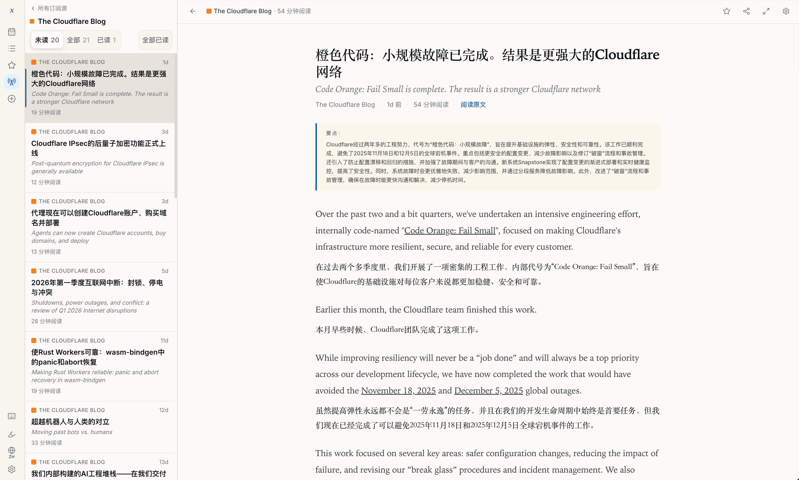

<div align="center">

# xReader

**AI 驱动的自托管 RSS 阅读器 — 自动翻译 + 要点总结**

[English](README.md) | **简体中文**

[功能](#功能) · [快速开始](#快速开始) · [部署](docs/deployment.zh-CN.md) · [贡献](docs/contributing.zh-CN.md)

</div>




---

## 功能

- **AI 双语阅读** — 标题自动翻译，原文+译文段落交替排列，每篇文章 3-5 条要点摘要
- **Fever API** — 支持 Reeder、NetNewsWire、Unread 等第三方客户端
- **全文搜索** — 支持中日韩文搜索，无需额外插件
- **高亮和笔记** — 选中文字高亮，添加笔记
- **深色模式 + 主题** — 浅色/深色/跟随系统，4 种强调色
- **OpenAI 兼容** — 支持 DeepSeek、Moonshot、one-api、OpenRouter 等中转
- **极简部署** — 单个二进制 + Postgres，仅 2 个容器
- **键盘优先** — `L`/`H` 切换文章、`J`/`K` 滚动、`S` 收藏、`R` 标记已读、`F` 专注模式

## 快速开始

```bash
git clone https://github.com/razeencheng/xreader.git
cd xreader
echo "SESSION_SECRET=$(openssl rand -hex 32)" > .env

docker compose up -d

# 查看日志获取初始设置令牌
docker compose logs xreader | grep "SETUP TOKEN"

# 打开 http://localhost:3000/setup → 输入令牌 → 完成配置
```

## 配置

| 变量 | 是否必填 | 说明 |
|---|---|---|
| `DATABASE_URL` | 是（compose 自动配置） | Postgres 连接字符串 |
| `SESSION_SECRET` | 是 | 用于会话签名的随机字符串 |
| `GITHUB_CLIENT_ID` | 否* | GitHub OAuth App 客户端 ID |
| `GITHUB_CLIENT_SECRET` | 否* | GitHub OAuth App 客户端密钥 |
| `GITHUB_CALLBACK_URL` | 否 | OAuth 回调 URL，例如 `https://your-domain/api/auth/github/callback` |
| `COOKIE_SECURE` | 否 | 使用 HTTPS 时设为 `true` |
| `SETUP_TOKEN` | 否 | 固定设置令牌（未设置时自动生成） |
| `XREADER_AI_ENCRYPTION_KEY` | 否 | 用于加密存储密钥的自定义密钥 |
| `XREADER_GA_ID` | 否 | Google Analytics 测量 ID；设置后在运行时注入 |

*可在首次运行时通过设置向导配置，也可通过环境变量设置。

## Fever API

连接第三方 RSS 客户端：

1. 前往 **设置 → 第三方客户端**
2. 设置一个 Fever 密码
3. 在客户端中添加 Fever 账号：
   - **服务器：** `https://your-domain/fever/`
   - **用户名：** 你的 GitHub 用户名
   - **密码：** 你设置的密码

已测试客户端：Reeder、NetNewsWire、Unread。

## 开发

```bash
# 前置要求：Go 1.25+、Node.js 20+、pnpm、Docker

# 启动数据库
make up

# 后端
cd server && go run ./cmd/xreader

# 前端（另开终端）
cd web && pnpm install && pnpm dev

# 测试
make test
```

## 路线图

- [ ] 本地用户名/密码登录
- [ ] 自动清理保留策略
- [ ] PWA 支持
- [ ] 健康监控面板
- [ ] 更多适配器（HackerNews、Reddit、Newsletter）
- [ ] Google Reader API

## 贡献

详见 [贡献指南](docs/contributing.zh-CN.md)。

## 许可证

[AGPL-3.0](LICENSE)
